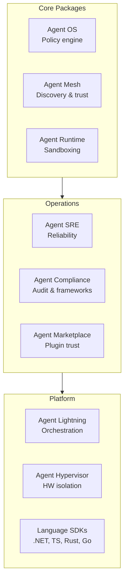

# Packages

AGT provides 50+ packages across 5 ecosystems covering every layer of agent governance.

## Core Packages

| Package | Description | Install |
|---------|------------|---------|
| [Agent OS](agent-os.md) | Policy engine, agent lifecycle, governance gate | `pip install agent-os-kernel` |
| [Agent Mesh](agent-mesh.md) | Agent discovery, routing, trust mesh | `pip install agentmesh-platform` |
| [Agent Runtime](agent-runtime.md) | Execution sandboxing, four privilege rings | `pip install agentmesh-runtime` |
| [Agent SRE](agent-sre.md) | Kill switch, SLO monitoring, chaos testing | `pip install agent-sre` |
| [Agent Compliance](agent-compliance.md) | Audit logging, compliance frameworks | `pip install agent-governance-toolkit` |
| [Agent Marketplace](agent-marketplace.md) | Plugin governance, marketplace trust | `pip install agentmesh-marketplace` |
| [Agent Lightning](agent-lightning.md) | High-performance orchestration | `pip install agentmesh-lightning` |
| [Agent Hypervisor](agent-hypervisor.md) | Hardware-level workload isolation | `pip install agent-hypervisor` |

## Language Packages & Tooling

| Package | Language | Install |
|---------|---------|---------|
| TypeScript SDK | TypeScript | `npm install @microsoft/agent-governance-sdk` |
| [Copilot CLI governance package](copilot-cli-governance.md) | Copilot CLI / Node.js | `npx @microsoft/agent-governance-copilot-cli install` |
| [Claude Code governance package](claude-code-governance.md) | Claude Code / Node.js | `claude --plugin-dir ./agent-governance-claude-code` |
| [.NET package](dotnet-sdk.md) | C# / .NET | `dotnet add package Microsoft.AgentGovernance` |
| Rust crate | Rust | `cargo add agentmesh` |
| Go module | Go | `go get github.com/microsoft/agent-governance-toolkit` |
| [VS Code Extension](agent-os-vscode.md) | VS Code | Install from marketplace |

## Framework Integrations (19)

| Integration | Framework | Install |
|-------------|----------|---------|
| langchain-agentmesh | LangChain | `pip install agentmesh-langchain` |
| langgraph-trust | LangGraph | `pip install langgraph-trust` |
| crewai-agentmesh | CrewAI | `pip install crewai-agentmesh` |
| adk-agentmesh | Google ADK | `pip install adk-agentmesh` |
| openai-agents-agentmesh | OpenAI Agents | `pip install openai-agents-agentmesh` |
| llamaindex-agentmesh | LlamaIndex | `pip install llamaindex-agentmesh` |
| haystack-agentmesh | Haystack | `pip install haystack-agentmesh` |
| flowise-agentmesh | Flowise | `pip install flowise-agentmesh` |
| langflow-agentmesh | LangFlow | `pip install langflow-agentmesh` |
| mastra-agentmesh | Mastra | `npm install @agentmesh/mastra` |
| copilot-governance | GitHub Copilot | `npm install @microsoft/agentmesh-copilot-governance` |
| pydantic-ai-governance | Pydantic AI | `pip install pydantic-ai-governance` |
| a2a-protocol | A2A Protocol | `pip install a2a-protocol` |
| mcp-trust-proxy | MCP | `pip install mcp-trust-proxy` |
| openshell-skill | NVIDIA OpenShell | `pip install openshell-agentmesh` |
| agentmesh-avp | Amazon Verified Permissions | `pip install agentmesh-avp` |
| structural-authz-agentmesh | Structural Authorization | `pip install structural-authz-agentmesh` |
| nostr-wot | Nostr Web-of-Trust | `pip install nostr-wot` |
| openai-agents-trust | OpenAI Trust | `pip install agentmesh-openai-agents-trust` |
