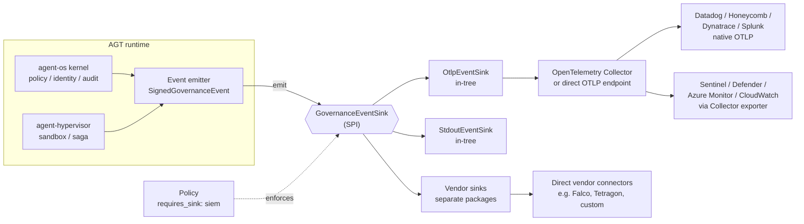

<!--
Copyright (c) Microsoft Corporation.
Licensed under the MIT License.
-->

# Governance Event Sink SPI

**Status:** Draft proposal
**Related issues:** #1999 (this design), #1793 (closed — OS-level enforcement, rejected)
**Related PR:** #1987 (Copilot-generated reference implementation, under review)

## Summary

Generalize the existing `SpanSink` Protocol pattern from `agent-hypervisor` into
a first-class **`GovernanceEventSink`** SPI in `agent-os`. AGT becomes a
structured, signed event producer; enforcement and observability backends
(Defender, Sentinel, Splunk, Datadog, Falco, Tetragon) plug in as sinks.
A policy can require a sink class and fail closed if no healthy sink is
attached, making sink presence an enforceable governance control.

## Goals

- One canonical interface for emitting governance events.
- Canonical signed event schema (OpenTelemetry semantic conventions inside a
  CloudEvents 1.0 envelope, with HMAC or Ed25519 signature and monotonic
  sequence number).
- Two reference sinks shipped in-tree: `OtlpEventSink` (covers every major
  SIEM/XDR via OTLP) and `StdoutEventSink` (dev/CI).
- Policy can require a sink class (`requires_sink: siem`) and fail closed.
- Vendor-native sinks live as separate optional packages — `agent-os` core
  takes no vendor SDK dependency.

## Non-goals

- Kernel-level enforcement (eBPF, WFP, kernel drivers) — see #1793.
- Replacing existing SIEM/EDR tooling.
- Inventing a new wire format — we adopt OTel + CloudEvents as-is.

## High-level design



Event flow:

1. Kernel and hypervisor emit governance events through a single emitter.
2. The emitter wraps each event in a CloudEvents envelope, signs it, and
   attaches a monotonic sequence number.
3. The configured sink(s) receive the signed event and forward it to the
   downstream backend.
4. Policy evaluates sink presence and health at startup and at runtime. If a
   `required_sinks` constraint is unmet, the agent fails closed.

## Event categories

| Category              | Emitted on                                    |
|-----------------------|-----------------------------------------------|
| `policy.decision`     | Every allow/deny decision                     |
| `policy.breach`       | Runtime policy violation                      |
| `identity.assertion`  | Agent identity issuance, token exchange       |
| `tool.invocation`     | Tool or MCP call attempted, with result       |
| `sandbox.event`       | Sandbox lifecycle, resource limit, escape     |
| `audit.chain`         | Append to the hash-chained audit log          |

## Envelope

CloudEvents 1.0 envelope; payload follows OTel semantic conventions. AGT
extension attributes:

| Field            | Purpose                                                   |
|------------------|-----------------------------------------------------------|
| `sequence`       | Monotonic per `(agent_id, sink)`. Gap = tamper or loss.   |
| `signature`      | HMAC-SHA256 (v1) or Ed25519 (v2) over canonical payload.  |
| `prev_hash`      | Hash of the previous event — chains the audit stream.     |
| `agent_id`       | DID of the emitting agent.                                |
| `tenant_id`      | Tenant scope.                                             |
| `policy_version` | Version of the policy bundle in force.                    |

Why HMAC for v1: zero new dependencies, sufficient for tamper-evidence when
the signing key is held by AGT and the sink is operated by the customer's SOC.
Ed25519 follows as v2 for cross-party verification.

## Policy integration

```yaml
governance:
  required_sinks:
    - class: siem        # any sink advertising the siem capability
      health: required   # fail closed if unhealthy
    - class: audit
      health: required
```

If no sink of the required class is attached and healthy at startup, the
kernel refuses to start. If a required sink becomes unhealthy at runtime,
behavior is policy-controlled (degrade, fail closed, alert only).

## Bypass-resistance

The sink is in-process, so a fully compromised runtime can in principle skip
emission. Two mitigations make tampering observable:

1. The downstream SIEM expects a steady heartbeat of events. Silence is
   itself a high-severity signal (standard EDR pattern).
2. The signed, sequence-numbered, hash-chained envelope means any gap, replay
   or alteration breaks verification at the sink.

Stronger out-of-process enforcement (Falco, Tetragon, Defender, EDR) is
delegated to the customer's existing backend, which is exactly the layer it
belongs in.

## Where it lives

- **Interface and envelope:** `agent-os` (kernel-level concern).
- **Reference sinks:** `agent-os` for `StdoutEventSink`; `agent-sre` for
  `OtlpEventSink` (keeps OTel optional in core). `OtlpEventSink` emits
  OpenTelemetry Protocol over gRPC or HTTP. Backends with native OTLP ingest
  (Datadog, Honeycomb, Dynatrace, Splunk Observability) receive events
  directly; backends without native OTLP (Sentinel, Defender, Azure Monitor,
  CloudWatch, Elastic) are reached via the OpenTelemetry Collector with the
  appropriate vendor exporter. Vendor fan-out is the Collector's job, not
  AGT's. Sensors that produce rather than consume events (Falco, Tetragon)
  sit alongside the OTLP path as separate vendor sinks.
- **Vendor sinks:** separate optional packages, e.g. `agt-sink-defender`,
  `agt-sink-sentinel`.
- **Hypervisor integration:** `agent-hypervisor` adapts its existing
  `SpanSink` to bridge into the new event sink so saga and sandbox spans
  flow through the same pipeline.

## Interface sketches

Python is the canonical shape. Other SDKs mirror it.

### Python (`agent-os`)

```python
from typing import Protocol, runtime_checkable
from dataclasses import dataclass
from enum import StrEnum

class SinkClass(StrEnum):
    SIEM = "siem"
    OBSERVABILITY = "observability"
    AUDIT = "audit"
    DEBUG = "debug"

@dataclass(frozen=True)
class SinkHealth:
    healthy: bool
    detail: str | None = None

@runtime_checkable
class GovernanceEventSink(Protocol):
    name: str
    classes: frozenset[SinkClass]

    async def emit(self, event: "SignedGovernanceEvent") -> None: ...
    async def health(self) -> SinkHealth: ...
```

### .NET (`agent-governance-dotnet`)

```csharp
public interface IGovernanceEventSink
{
    string Name { get; }
    IReadOnlySet<SinkClass> Classes { get; }

    Task EmitAsync(SignedGovernanceEvent evt, CancellationToken ct = default);
    Task<SinkHealth> HealthAsync(CancellationToken ct = default);
}
```

### Rust (`agent-governance-rust`)

```rust
#[async_trait::async_trait]
pub trait GovernanceEventSink: Send + Sync {
    fn name(&self) -> &str;
    fn classes(&self) -> &HashSet<SinkClass>;

    async fn emit(&self, event: &SignedGovernanceEvent) -> Result<(), SinkError>;
    async fn health(&self) -> SinkHealth;
}
```

### TypeScript (`agent-governance-typescript`)

```ts
export interface GovernanceEventSink {
  readonly name: string;
  readonly classes: ReadonlySet<SinkClass>;

  emit(event: SignedGovernanceEvent): Promise<void>;
  health(): Promise<SinkHealth>;
}
```

### Go (`agent-governance-golang`)

```go
type GovernanceEventSink interface {
    Name() string
    Classes() map[SinkClass]struct{}

    Emit(ctx context.Context, evt SignedGovernanceEvent) error
    Health(ctx context.Context) SinkHealth
}
```

## Decisions

- **Delivery semantics:** at-least-once. Sinks must be idempotent on
  `(agent_id, sequence)`. The emitter retries with bounded exponential backoff;
  on permanent failure the event is written to a local spool and replayed on
  reconnect.
- **Multi-sink fanout:** parallel. The emitter calls every attached sink
  concurrently. One sink failing does not block the others. Per-sink failures
  surface through `health()` and are evaluated by policy.
- **Signing key management:** bring-your-own. The signing key is supplied via
  configuration and may be backed by any KMS (Azure Key Vault, AWS KMS, HSM,
  file). AGT does not generate or rotate keys itself. Key identifier is
  carried in the envelope so verifiers can resolve the correct key.
- **Audit log subsystem:** the existing audit log becomes a sink
  (`AuditChainSink`) that implements the same interface and writes
  `audit.chain` events to the hash-chained store. The audit log stops being a
  parallel pipeline and becomes one consumer of the unified event stream.
- **Schema versioning:** the CloudEvents `dataschema` attribute carries a
  semver URI (e.g. `https://agt.dev/schemas/governance-event/1.0`). Sinks
  must accept any minor version they recognize the major of and ignore
  unknown extension attributes. Breaking changes bump the major.
- **Backpressure:** bounded in-memory queue per sink (default 10k events).
  When full, behavior is policy-controlled per sink class — `audit` and
  `siem` block the emitter (fail-closed semantics); `observability` and
  `debug` drop oldest with a counter event. The drop counter is itself
  emitted as a `policy.breach` so a SIEM sees it.

## Next steps

1. Directional review of this proposal by the AGT team.
2. Resolve open questions and finalize schema.
3. Break implementation into tickets, using #1987 as the reference branch
   (after addressing review feedback): Python Protocol + schema → reference
   sinks → policy integration → SDK ports → docs and examples.
